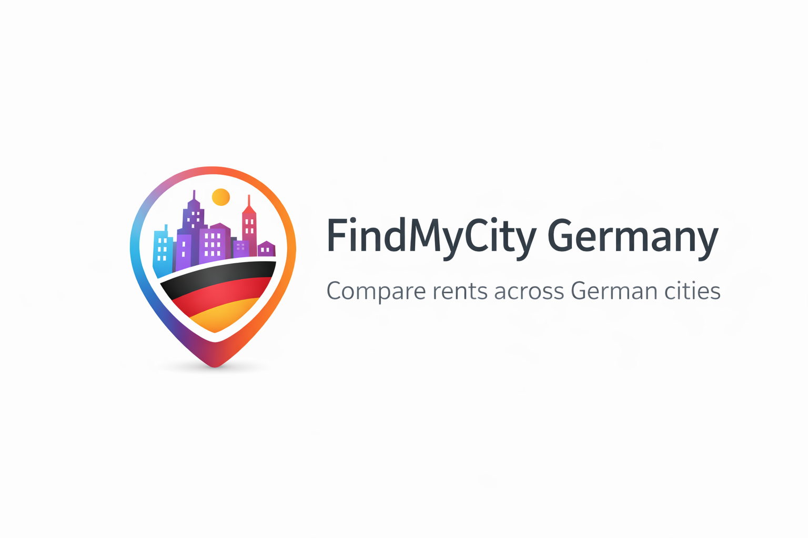
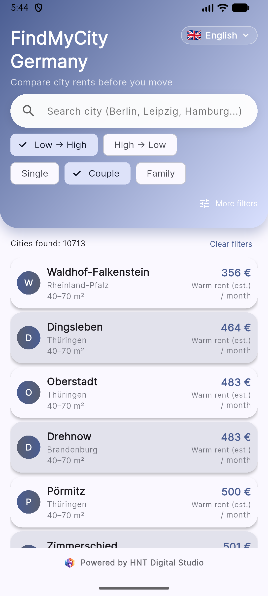
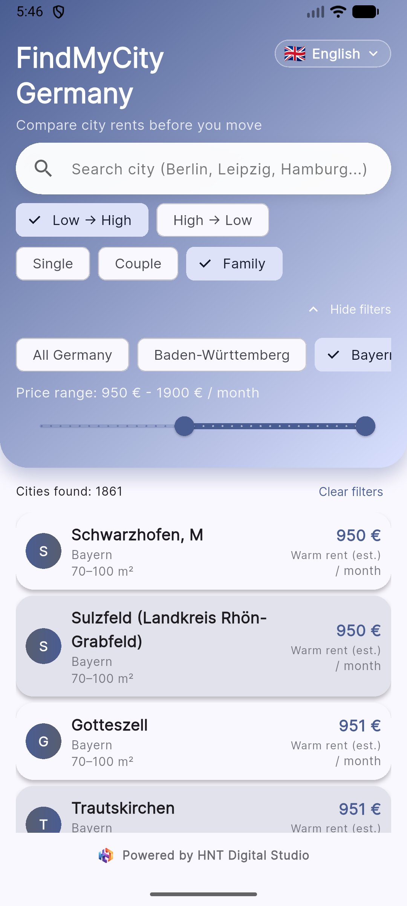
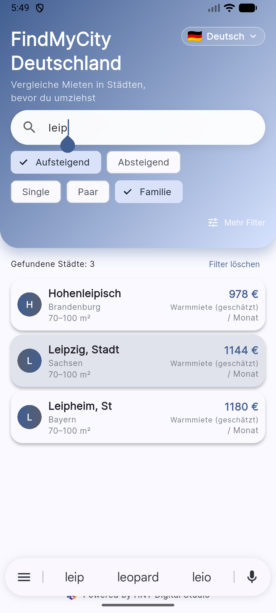
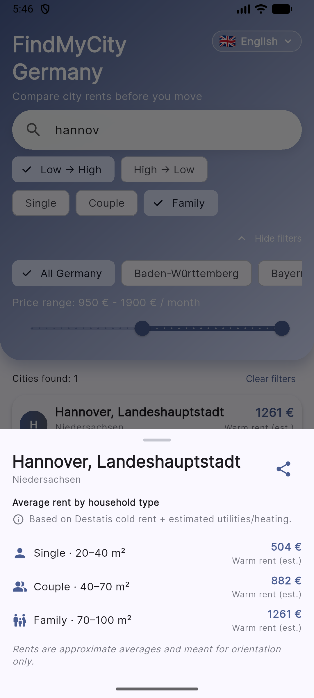

# FindMyCity Germany 🇩🇪

**FindMyCity Germany** is a Flutter app that helps expats, students and professionals  
quickly **compare rents across German cities** – completely offline, from a single screen.

The app is built and published under **HNT Digital Studio** and focuses on:
- fast, offline browsing of thousands of cities,
- clear rent ranges for **Single / Couple / Family**,
- simple filters for **budget** and **Bundesland**.

> 🔒 The dataset and full Flutter source code are **not part of this repo**.  
> This repository is a **public product + UI showcase** with screenshots and a high-level technical overview.

---

## Ownership & repository purpose

FindMyCity Germany is now a product of **HNT Digital Studio**.  
I originally designed and built the app; **ongoing development and full source code
have been moved to a private HNT Digital Studio repository** for business reasons
(dataset licensing, branding, and future commercial plans).

👉 **This public repo is a _demo / portfolio overview_ only.**  
It contains:

- Product description
- Screenshots
- High-level technical notes

It **does not** contain the production Flutter source code or rent dataset.

If you are a recruiter or hiring manager and want to see the architecture or code
structure, I’m happy to walk you through it in an interview or screen-share.

---

## 1. Who this app is for

- People planning a move inside Germany (students, expats, families)
- Recruiters and relocation consultants who need a quick “rent sanity check”
- Anyone comparing cities before sending applications or signing a lease

The goal is to answer:  
> “If I move to *X*, what does rent roughly look like for a single / couple / family?”

---

## 2. Screenshots

### Home & filters

| Home (English) | More filters & results |
| -------------- | ---------------------- |
|  |  |

### Multilingual & detail view

| Home (German) | City detail bottom sheet |
| ------------- | ------------------------ |
|  |  |

---

## 3. Key features

- 🔍 **Search & sort**
  - Live search bar (city name)
  - Sort by rent: **Low → High** / **High → Low**

- 🧑‍🤝‍🧑 **Household-aware filtering**
  - Toggle **Single / Couple / Family**
  - Rents mapped to realistic m² bands per household type

- 🗺 **Region & budget filters**
  - Filter by **Bundesland** (or “All Germany”)
  - Price range slider with live “Cities found” counter

- 🌐 **Multilingual UI**
  - English, German and additional languages for expats
  - Language choice persisted across sessions

- 📤 **Share & explain**
  - Share a city’s rent summary as text
  - Detail sheet shows household-level rent breakdown and explanation text

- ⚡ **Offline-first**
  - Encrypted local dataset (no network calls during normal usage)
  - Designed to stay fast even with thousands of cities

---

## 4. Tech highlights (high level)

- **Flutter (Material 3)** UI with a calm, data-focused design
- **Encrypted JSON asset** (`cities.enc`) loaded and decrypted at runtime  
  (raw dataset is kept outside of the public repo)
- Simple internal data model:
  - `City` with name, Bundesland, optional population info
  - `RentBand` entries per household type (single / couple / family)
- Local settings via **SharedPreferences**:
  - UI language
  - theme/seed color (planned)
  - onboarding flags
- Reusable UI components for:
  - filter chips
  - rent cards
  - bottom-sheet detail view

---

## 5. My role

I’m responsible for:

- Product idea & UX flows (city comparison, filters, onboarding)
- Flutter implementation (UI, state handling, navigation)
- Design of the **rent band model** and mapping household types → m² ranges
- Dataset tooling and encryption pipeline (JSON → encrypted asset)
- Play Store packaging (keystore, AAB build, closed testing)

---

## Status & links

- **Product owner / original author:** Deepak Togarla  
- **Current ownership:** HNT Digital Studio (private repo)  
- **Release status:** Closed testing on Google Play; public rollout planned  
- **Play Store link:** will be added here once the app is publicly available
- **Email:** [deepaktogarla15@gmail.com](mailto:deepaktogarla15@gmail.com)  
- **LinkedIn:** [linkedin.com/in/deepak-togarla](https://www.linkedin.com/in/deepak-togarla)

If you’re reviewing this for a role and would like more technical detail
(project structure, architecture choices, data modelling), I’m happy to explain
how the app is built and walk through representative code examples.

